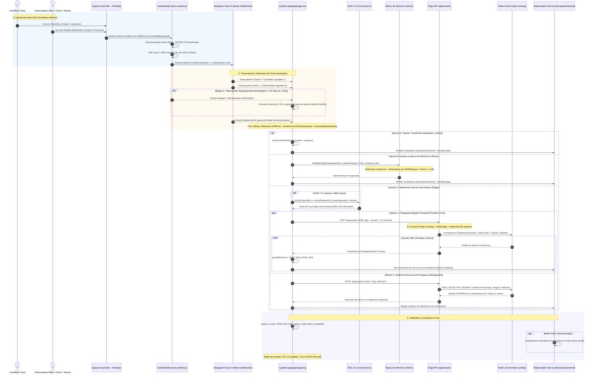
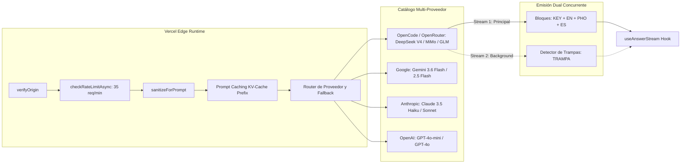

# 🏗️ Arquitectura y Mapeo del Flujo de Loro Copilot

Este documento detalla el mapa técnico integral, el ciclo de vida de los datos, los diagramas de secuencia, los modelos y los componentes que componen el funcionamiento en tiempo real de **Loro Copilot**.

---

## 🧭 1. Mapa Visual del Flujo de Datos de Extremo a Extremo



---

## 🔄 2. Desglose Fase por Fase del Flujo

### Fase 1: Ingesta y Captura Dual Simultánea (Stereo 🎧)
El sistema resuelve de raíz el problema clásico del audio en llamadas (donde capturar solo mic ignora al entrevistador y capturar solo pestaña no capta al candidato o acopla):
- **Modos de Captura Soportados:**
  - **Dual Simultáneo (🎧 Predeterminado y Recomendado):**
    - **Canal Izquierdo (L / Canal 0):** Voz del candidato adquirida mediante `navigator.mediaDevices.getUserMedia({ audio: { echoCancellation: true, noiseSuppression: true } })`.
    - **Canal Derecho (R / Canal 1):** Audio del entrevistador adquirido mediante `navigator.mediaDevices.getDisplayMedia({ video: true, audio: true })`. Los tracks de video se cancelan de inmediato (`track.stop()`) preservando 100% de CPU y GPU.
    - **Mezcla Estéreo Nativa:** Un `ChannelMergerNode(2)` de la Web Audio API combina ambos streams en un único nodo estéreo entrelazado.
  - **Modo Micrófono Solo:** Captura clásica mono del micrófono.
  - **Modo Pestaña Solo:** Captura clásica mono del audio del sistema.
- **WakeLock API:** Se adquiere un centinela de pantalla (`navigator.wakeLock.request("screen")`) para prevenir que el sistema operativo suspenda procesos en segundo plano durante llamadas extensas.

### Fase 2: Remuestreo, VAD Local y Barge-in (`public/pcm-worklet.js`)
- **Procesamiento de Audio en Hilo Aislado (`AudioWorklet`):**
  - Los navegadores capturan nativamente a 44.1kHz o 48kHz en punto flotante (`Float32Array`).
  - El procesador `pcm-worklet.js` se ejecuta en el hilo de audio del navegador sin bloquear el hilo principal de React.
  - Realiza el downsampling lineal a 16kHz y la cuantización a números enteros de 16 bits (`Int16Array PCM16`).
  - Soporta buffers estéreo entrelazados `[L0, R0, L1, R1, ...]`.
- **VAD Local y Medición RMS Dual (<80ms):**
  - Calcula la energía RMS independiente para `micRms` y `tabRms` en cada frame.
  - Detecta actividad de voz o silencio localmente en menos de 80ms, reduciendo la dependencia de latencias de red.
- **Auto-Cancelación por Barge-in Inteligente (Interrupción del Entrevistador):**
  - Si el entrevistador comienza a hablar con una intervención sustancial (`transcript.length >= 15`), el Copiloto evalúa la ventana temporal: solo si ya transcurrieron más de **4.5 segundos** desde el inicio de la generación de la respuesta (`generationStartTimeRef`), se activa la cancelación vía `AbortController`. Esto previene de forma determinante que ecos finales de la pregunta, fragmentos breves ("ok", "sí") o ruidos de fondo de la pestaña aborten la respuesta en curso.
- **Limpieza de Nodos Web Audio:**
  - En modo Dual, `micSource`, `tabSource` y `merger` quedan registrados en `dualSourcesRef` y se desconectan de manera estricta junto al `AudioContext` para evitar acumulación de handles y fugas de memoria en el navegador.

### Fase 3: Transcripción Multicanal en Streaming (Deepgram Nova-2)
- **Credenciales Efímeras Seguras (`/api/deepgram-token`):**
  - La API Key permanente de Deepgram nunca se expone al cliente. Se emite un grant temporal de 60 segundos vía `POST https://api.deepgram.com/v1/auth/grant`.
- **Configuración del WebSocket:**
  ```javascript
  const params = {
    model: "nova-2",
    language: lang === "en" ? "en" : "multi",
    smart_format: "true",
    interim_results: "true",
    endpointing: "1000",
    utterance_end_ms: "1500",
    vad_events: "true",
    diarize: isDual ? "false" : "true",
    encoding: "linear16",
    sample_rate: "16000",
    channels: isDual ? "2" : "1",
    multichannel: isDual ? "true" : "false",
  };
  ```
- **Diarización 100% Determinística por Canales:**
  - `Canal 0 (L)` = Micrófono Candidato ➔ mapeado a `speaker = 1`.
  - `Canal 1 (R)` = Pestaña Entrevistador ➔ mapeado a `speaker = 0`.
  - Al aislar físicamente los canales, se elimina la ambigüedad acústica sobre quién hizo la pregunta.

### Fase 4: Inteligencia de Detección de Turno (`Turn-Taking Engine`)
Para no disparar respuestas ante silencios breves o pausas de respiración:
1. **Detección de Fin de Habla:** Disparada por VAD local o el evento `UtteranceEnd` de Deepgram.
2. **Debounce Adaptativo (1000ms):** Ventana de espera prudencial para permitir pausas naturales de pensamiento del interlocutor.
3. **Filtro de Candidato:** Si el último hablante registrado fue el candidato (`speaker === 1`), no se auto-genera respuesta para prevenir bucles de eco.
4. **Validación de Pregunta Incompleta (`isIncompleteQuestion`):**
   - Detecta si la frase quedó truncada (conectores terminales como *"and"*, *"or"*, *"pero"*, *"because"*, *"if"*, o preguntas de longitud menor a 6 caracteres). Si es incompleta, el motor posterga la generación.
5. **Aislamiento del Turno Actual (`extractCurrentTurnQuestion`):**
   - Extrae con precisión quirúrgica únicamente la última pregunta relevante sin concatenar texto previo ya respondido.

### Fase 5: RAG Semántico Local del CV (`app/lib/cvChunker.ts`)
Para evitar saturar la ventana de contexto o diluir la respuesta:
- **Segmentación (`chunkCv`):** Divide el CV del candidato en bloques semánticos estructurados (experiencia laboral por empresa, proyectos destacados, stack tecnológico, certificaciones).
- **Recuperación Quirúrgica (`selectRelevantCvChunks`):**
  - Si el perfil supera los 800 caracteres, compara los tokens y palabras clave de la pregunta con cada bloque del CV.
  - Extrae y prioriza los 1 o 2 bloques con mayor coincidencia temática para inyectarlos en el prompt del LLM, garantizando respuestas con anclaje real en la experiencia del candidato.

---

## 🧠 3. Árbol de Decisión de Respuestas: Caché Inteligente vs LLM

Antes de invocar modelos generativos externos, el sistema evalúa dos niveles de caché local de latencia ultrabaja:

```mermaid
flowchart TD
    A[Pregunta Detectada / Disparada] --> B{¿Es Saludo o Small Talk?}
    B -- Sí (<10ms) --> C[checkInstantGreeting: Retorno Inmediato]
    B -- No --> D{¿Existe en Banco de Memoria?}

    D -- Sí --> E[findMatchingAnswer: Tokenización + Sinónimos Canónicos]
    E --> F{¿Coincide Empresa y Rol?}
    F -- No --> G[Descartar / Evitar Contaminación]
    F -- Sí --> H{Score Multidimensional >= 0.65}
    H -- Sí (<50ms) --> I[Retornar MasterAnswer Local]
    H -- No --> J[RAG de CV: chunkCv + selectRelevantCvChunks]

    D -- No --> J
    J --> K[POST /api/answer: Stream 1 (Fast Answer)]
    J -.->|Paralelo en Background| L[POST /api/answer: Stream 2 (Trap Detector)]
    
    C --> M[Render UI Copiloto + Sincronización Teleprompter HUD]
    I --> M
    K --> M
    L -.->|Si detecta trampa| M
```

### Nivel 1: Saludo Inmediato (`<10ms`)
- Maneja frases de apertura como *"Hi, can you hear me?"*, *"Good morning"*, *"How are you today?"*.
- Resuelve en menos de 10ms con respuestas amables y contextualizadas con el nombre de la empresa sin consumir cuota de LLM.

### Nivel 2: Banco de Memoria Inteligente (`<50ms`)
Diseñado para preguntas frecuentes de screening, background, arquitectura y metodología STAR:
1. **Normalización y Sinónimos Canónicos (`CANONICAL_SYNONYMS`):**
   - Homologa conceptos equivalentes (ej. `pets`, `dogs`, `mascotas` ➔ `pet_concept`; `salary`, `rate`, `sueldo` ➔ `salary_concept`; `weekend`, `finde` ➔ `weekend_concept`).
2. **Aislamiento Multi-CV Determinístico:**
   - `matchesCompany(itemCompany, targetCompany)`: Impide que respuestas preparadas para una empresa se filtren en la entrevista de otra.
   - `matchesRole(itemRole, targetRole)`: Aísla el dominio técnico del puesto (ej. descarta respuestas de `[Rol: DBA]` si la entrevista actual es para `DevOps Architect`).
3. **Scoring Multidimensional:**
   - Coeficiente Jaccard (25%) + Sørensen-Dice (35%) + Cobertura Efectiva de Consulta (40%).
   - Bonus por coincidencia exacta de frase (+0.15) y tags (+0.08). Umbral mínimo: `>= 0.65`.
4. **Auto-aprendizaje (Active Learning):**
   - Cuando el usuario pulsa 👍 en una respuesta del LLM, el sistema la almacena automáticamente en el banco de memoria local (`tags: ["aprendido", "feedback_positivo"]`).

---

## ⚡ 4. Pipeline de Inferencia Edge, Prompt Caching y Dual Stream (`/api/answer`)

Cuando se requiere inferencia generativa:



### Modelos Soportados y Latencias de Referencia

| Nivel de Velocidad | Modelo | Proveedor | TTFT / Latencia Típica | Caso de Uso Principal |
|---|---|---|---|---|
| **Ultra Rápido ⚡** | `gemini-3.6-flash` | Google | ~500ms TTFT (6.0s total) | Entrevista en vivo de máxima velocidad |
| **Ultra Rápido ⚡** | `mimo-v2.5` | OpenCode | ~600ms TTFT (6.2s total) | Entrevistas en inglés fluido |
| **Ultra Rápido ⚡** | `glm-5.3-flash` | OpenCode | ~650ms TTFT (6.5s total) | Respuestas técnicas directas |
| **Ultra Rápido ⚡** | `deepseek-v4-flash` | OpenCode | ~700ms TTFT (6.6s total) | Modelo predeterminado en vivo |
| **Pro / Senior 🧠** | `deepseek-v4-pro` | OpenCode | ~800ms TTFT (6.7s total) | Arquitectura y algoritmos complejos |
| **Ultra Rápido ⚡** | `glm-5.2` | OpenCode | ~700ms TTFT (6.9s total) | Soporte multi-idioma |
| **Ultra Rápido ⚡** | `qwen-3.8-flash` | OpenCode | ~800ms TTFT (7.6s total) | Alta precisión semántica |
| **Ultra Rápido ⚡** | `mimo-v2-5-pro` | OpenCode | ~850ms TTFT (7.9s total) | Explicaciones en profundidad |
| **Balanceado 🚀** | `grok-4.6` | OpenCode | ~1.0s TTFT (9.2s total) | Respuestas balanceadas |
| **Coding 💻** | `kimi-k2-7-code` | OpenCode | ~1.2s TTFT (12.3s total) | Live coding y sintaxis estricta |
| **Deep Think 🔮** | `hy4-preview` / `qwen-3.8-max` | OpenCode | > 2.0s TTFT (>16s total) | Preguntas de diseño de sistemas pesadas |
| **Fallback Estándar** | `gpt-4o-mini` / `claude-3-5-haiku` | OpenAI / Anthropic | ~600ms TTFT | Conmutación por falla de cuota |

### Blindaje, Prompt Caching y Seguridad
- **Vercel Edge Runtime:** `export const runtime = "edge"` desplegado globalmente para minimizar latencia de red.
- **Prompt Caching en KV-Cache:** El system prompt estático y las instrucciones fijas se ubican al inicio del prompt como prefijo invariante, reduciendo el costo en un ~75% y rebajando el TTFT.
- **Sanitización Anti-Inyección (`sanitizeForPrompt`):** Convierte caracteres `<` y `>` en comillas angulares equivalentes (`‹`, `›`), anulando cualquier vector de inyección de prompt proveniente del audio transcripto o datos del usuario.
- **Rate Limit por IP:** 35 solicitudes/minuto con deslizamiento en memoria.
- **Control de Capacidad (`checkCapacity`):** Kill switch de servicio si el tráfico satura los umbrales configurados.

### Formato Punchline First y Bloques Especializados (`parseBlocks`)
1. **`[KEY]` (Punchline First):** 3 a 5 palabras clave telegráficas para que el candidato comience a hablar de inmediato sin titubear.
2. **`[EN]`:** Respuesta hablada concisa en primera persona para perfiles Senior (apertura directa de 1 frase + 2 a 3 viñetas breves de 8 a 14 palabras).
3. **`[PHO]`:** Fonética simplificada en español con acentuación tónica en mayúsculas (ej. `DE-ko-rei-ter`, `kub-er-NE-tis`, `AR-ki-tek-chur`).
4. **`[ES]`:** Resumen conceptual rápido en español para tranquilidad cognitiva.
5. **`[WHY_NOT]`:** Alternativa popular descartada con justificación técnica cuantitativa (latencia, costo, límites de memoria).
6. **`[EDGE_CASES]`:** Casos límite y trampas de test cases a consensuar antes de programar en vivo.
7. **`[DRY_RUN]`:** Trazado de estados paso a paso para relatar la ejecución de algoritmos con naturalidad.
8. **`[TRAMPA]`:** Bloque opcional emitido por el detector asíncrono de trampas que resalta sesgos, premisas falsas o trucos en la pregunta.

### Parser de Bloques en Streaming y Filtro Anti-Slop
- **Extracción Dinámica en Streaming (`extractAndRemove`):** Extrae bloques terminales (`[WHY_NOT]`, `[DRY_RUN]`, `[EDGE_CASES]`) en tiempo real mientras el modelo emite tokens, evitando que texto en progreso se filtre de forma desordenada en el cuerpo principal de la respuesta.
- **Limpieza de Marcadores de Razonamiento:** Remueve automáticamente etiquetas de pensamiento residuales (`🧠 *Analizando respuesta...*`) para garantizar tarjetas limpias.
- **Filtro Anti-Slop Seguro (`cleanAiSlop`):** Remueve muletillas formuláicas de modelos conversacionales con salvaguarda estricta `MAX_ITERATIONS = 10` y verificación de longitud (`match[0].length > 0`), asegurando que jamás se bloquee el Event Loop de JavaScript.

---

## 🪟 5. Sincronización HUD Pop-out y Lectura Biónica (`/teleprompter`)

Ventana flotante ultraliviana (540x380) diseñada para ubicarse justo debajo de la lente de la cámara web, permitiendo mantener contacto visual con el entrevistador:

- **Protocolo de Comunicación de Cero Latencia:**
  1. `BroadcastChannel("loro_teleprompter_channel")`: Transmisión en memoria entre pestañas locales en 0ms.
  2. Fallback con `localStorage("loro_teleprompter_data")` y evento `storage` ante recargas.
- **Lectura Biónica (Bionic Reading):**
  - La función `renderBionicText()` calcula el punto medio de cada palabra (`Math.ceil(word.length / 2)`) y resalta las primeras letras en `<strong className="text-white font-black">`.
  - El cerebro del candidato completa la palabra mediante visión periférica sin requerir movimientos oculares visibles.
- **Chips de Palabras Clave `[KEY]`:** Renderizados como badges destacados en la parte superior para dar dirección discursiva inmediata.
- **Banner de Alerta de Trampas:** Notificación destacada en color ámbar/rojo ante advertencias de preguntas trampa.
- **Botón Panic (`Escape`):**
  - Al pulsar `Escape`, la interfaz oculta de inmediato el texto y muestra una pantalla neutral (*"Pantalla en pausa. Presioná Escape para reanudar"*), eliminando cualquier riesgo de exposición involuntaria en pantalla compartida.
- **Auto-scroll Adaptativo y Zoom Tipográfico:** Desplazamiento automático al pie y controles `A+` / `A-`.

---

## 🎙️ 6. Telemetría de Habla en Vivo (Speech Coach - `app/lib/speechCoach.ts`)

Analizador en tiempo real de los patrones de comunicación vocal del candidato:
- **WPM (Words Per Minute):**
  - Mide la cadencia de habla en tiempo real.
  - Semáforo visual: Verde (120-150 WPM = ritmo óptimo profesional), Amarillo (<110 WPM = lento/dubitativo, >160 WPM = apresurado/nervioso).
- **Balance de Conversación (Talk-to-Listen Ratio):**
  - Porcentaje acumulado de tiempo hablando el candidato vs. escuchando al entrevistador, previniendo monopolizar la conversación.
- **Contador de Muletillas (Fillers):**
  - Detección en vivo de muletillas en inglés (*"like"*, *"you know"*, *"um"*, *"uh"*, *"actually"*, *"basically"*) y español (*"tipo"*, *"o sea"*, *"este"*, *"nada"*, *"bueno"*), alertando sutilmente para pulir la elocuencia.

---

## ⌨️ 7. Atajos de Teclado Globales

| Atajo | Ámbito | Acción |
|---|---|---|
| `Ctrl + 1` | Global | Enfocar la pestaña principal del Copiloto en vivo. |
| `Ctrl + 2` | Global | Abrir o enfocar la ventana emergente flotante del Teleprompter HUD. |
| `Ctrl + Shift + S` | Global Copiloto | **Screen Vision & Live OCR:** Capturar pantalla/pestaña para resolver LeetCode o diagramas de arquitectura. |
| `Ctrl + Shift + Q` | Global Copiloto | **Cierre de Oro:** Generar al instante 3 repreguntas estratégicas ancladas a los dolores del entrevistador. |
| `Escape` | Teleprompter HUD | Activar / Desactivar el modo Panic (ocultar pantalla de inmediato). |

---

## 🎯 8. Flujo del Modo Simulador (`/simulador`)

Entorno cerrado para práctica y entrenamiento con evaluación automática:

```
[ Usuario selecciona Rol + CV + Dificultad ]
                  │
                  ▼
   [ Loop Interactivo de Simulación ]
         ┌────────┴────────┐
         │                 │
         ▼                 ▼
   [ IA Pregunta ]   [ Candidato Responde ]
   (TTS Web Speech)  (Audio STT / Texto)
         │                 │
         └────────┬────────┘
                  │ (Al completar rondas o pulsar Finalizar)
                  ▼
   [ API /api/simulador (type: feedback) ]
                  │
                  ▼
   [ Reporte Evaluativo Estructurado JSON ]
   ├── Score Global (0 - 100) y Nivel (Junior / Semi-Senior / Senior / Staff)
   ├── Veredicto de Contratación (Strong Hire / Hire / Weak / No Hire)
   ├── Radar: Claridad, Estructura, Fit Técnico, Confianza, Comunicación
   ├── Fortalezas y Áreas de Mejora
   └── Desglose Pregunta por Pregunta con Respuesta Modelo Ideal
```

---

## 📁 9. Mapeo de Archivos y Componentes del Repositorio

| Módulo / Componente | Archivo | Responsabilidad Principal |
|---|---|---|
| **Página Principal Copiloto** | `app/app/page.tsx` | Orquestación general, switches de audio dual, vúmetro estéreo, Screen Vision (`Ctrl+Shift+S`), Susurro al Oído, Cierre de Oro (`Ctrl+Shift+Q`), render de transcripción, respuestas y atajos globales. |
| **Hook Audio / STT** | `app/hooks/useDeepgram.ts` | Captura dual (Mic + Pestaña), `ChannelMergerNode`, ciclo de vida WebSocket Deepgram, VAD local, barge-in, reconexión y pre-fetching especulativo en turnos largos. |
| **Hook Respuestas LLM** | `app/hooks/useAnswerStream.ts` | Saludo instantáneo (<10ms), matching en memoria (<50ms), RAG de CV, streaming SSE principal, pre-fetch especulativo, callback `onPunchline`, Dual Stream de trampas en background y soporte multimodal. |
| **Hook Screen Vision** | `app/hooks/useScreenVision.ts` | Captura en vivo de pantalla vía `getDisplayMedia`, renderizado en `HTMLCanvasElement`, compresión WebP base64 ultraliviana para Vision Coding. |
| **Hook Susurro al Oído** | `app/hooks/useEarbudWhisper.ts` | Sintetizador de voz Web Speech API acelerado (1.5x) para dictado privado del punchline `[KEY]` al auricular del candidato. |
| **Hook Teleprompter** | `app/hooks/useTeleprompter.ts` | Apertura de ventana emergente y sincronización bidireccional en tiempo real vía `BroadcastChannel` y `localStorage`. |
| **Hook Contexto Entrevista** | `app/hooks/useInterviewContext.ts` | Gestión de perfiles de entrevista, CVs, empresa, rol, modelo seleccionado y persistencia del banco maestro. |
| **Worklet de Audio PCM16** | `public/pcm-worklet.js` | AudioWorklet en hilo de audio: downsampling lineal a 16kHz, conversión Float32 a Int16 estéreo, RMS dual y VAD local. |
| **Segmentación RAG & Grafo Temporal** | `app/lib/cvChunker.ts` | Chunking semántico del CV, inferencia de seniority (`Architect`, `Lead`, `Senior`), extracción de impacto cuantitativo ($ / % / QPS) y recuperación ordenada por recencia temporal. |
| **Sandbox de Código & Big-O** | `app/lib/codeEvaluator.ts` | Validador estático client-side de sintaxis (JS/TS/Python), balanceo de delimitadores, sangría en Python y extracción de complejidades Big-O temporal y espacial. |
| **Speech Coach** | `app/lib/speechCoach.ts` | Telemetría en vivo: cálculo de WPM, ratio de conversación (Talk-to-Listen) y detección de muletillas. |
| **Helpers de Entrevista** | `app/lib/interviewHelpers.ts` | Sinónimos canónicos, clasificación temprana de preguntas, detector de preguntas trampa, buscador en memoria y parser de 4 bloques. |
| **Clientes y Parsers LLM** | `app/lib/llm.ts` | Clientes HTTP y parsers SSE para OpenCode, Google Gemini, OpenAI y Anthropic con soporte multimodal (`options.image`), timeouts y fallback. |
| **Seguridad y Rate Limiting** | `app/lib/security.ts` | Verificación de `Origin`/`Referer`, rate limiter en memoria (35 req/min) y comprobación de capacidad del servidor. |
| **HUD Teleprompter** | `app/teleprompter/page.tsx` | Ventana pop-out flotante stealth con Always-on-Top nativo (`documentPictureInPicture`), control de opacidad, Lectura Biónica, chips `[KEY]`, alerta de trampas y botón Panic (`Escape`). |
| **Página Simulador** | `app/simulador/page.tsx` | Interfaz de entrenamiento interactivo con voz TTS (Web Speech API) y reporte evaluativo post-entrevista. |
| **API Generación Respuestas** | `app/api/answer/route.ts` | Runtime Edge, Prompt Caching (KV-Cache), Punchline First, Spanglish técnico, Vision Coding (`mode: "vision_coding"`), Cierre de Oro (`type: "reverse_questions"`) y detector de trampas en background (`mode: "trap_detector"`). |
| **API Token Deepgram** | `app/api/deepgram-token/route.ts` | Emisión de tokens efímeros de 60 segundos para aislar la API key de Deepgram del frontend. |
| **API Simulador** | `app/api/simulador/route.ts` | Generador de preguntas dinámicas y evaluación estructurada JSON de la entrevista simulada. |
| **API Resumen Post-Entrevista** | `app/api/summary/route.ts` | Generador de minutas y resúmenes ejecutivos en Markdown de la entrevista completa. |

---

## 🚀 10. Las 8 Capacidades Estratégicas Avanzadas

### 1. Screen Vision & Live OCR Multimodal (`Ctrl+Shift+S`)
- **Problema resuelto:** En live-coding (LeetCode, HackerRank, CoderPad) o diagramas de arquitectura en Miro/Excalidraw, transcribir el enunciado o código a mano consume tiempo valioso y genera errores.
- **Implementación:** `useScreenVision` captura la pantalla o ventana del ejercicio mediante `getDisplayMedia()`, dibuja el frame en un canvas invisible de 1280px y lo codifica a WebP (calidad 0.82) en Base64. Se envía al endpoint `/api/answer` con `mode: "vision_coding"` procesado por modelos multimodales (Gemini 2.5 Flash, GPT-4o, Claude 3.5 Sonnet, OpenCode).
- **Salida:** Enfoque algorítmico estructurado, código de producción limpio con tipado estricto y análisis formal Big-O de tiempo y espacio.

### 2. Generación Especulativa Temprana (Pre-Warming)
- **Problema resuelto:** Esperar a que el entrevistador finalice una pregunta extensa (10-20 segundos) acumulando 1.5s de debounce añade latencia innecesaria.
- **Implementación:** `useDeepgram` monitoriza el canal del entrevistador (`speaker 0`). Al acumularse más de 30 caracteres en un turno activo continuo, dispara un pre-fetch especulativo en background (`startSpeculativePreFetch`). Cuando el entrevistador finaliza su turno formalmente, si la pregunta definitiva es continuación del prefijo pre-calentado, `useAnswerStream` adopta el `Response` ya en vuelo en 0ms.

### 3. Modo "Cierre de Oro" (Reverse Interviewer / `Ctrl+Shift+Q`)
- **Problema resuelto:** Al final de la entrevista ("¿Tenés alguna pregunta para nosotros?"), hacer preguntas genéricas reduce el impacto del candidato.
- **Implementación:** El motor analiza todo el transcript acumulado de la sesión, identifica tecnologías mencionadas, desafíos de escalabilidad y dolores organizacionales expresados por el entrevistador, y formula 3 repreguntas quirúrgicas de alto nivel (Arquitectura/Deuda Técnica, Cultura/Autonomía y Métricas de Éxito a 90 días).

### 4. Modo "Susurro al Oído" (Earbud Audio Whisperer)
- **Problema resuelto:** En entrevistas con webcam activa, desviar la mirada al teleprompter puede delatar la lectura de notas.
- **Implementación:** `useEarbudWhisper` se engancha al evento `onPunchline` del streaming. Apenas el LLM emite el bloque `[KEY]` (primeros 500ms), la Web Speech API sintetiza el punchline a 1.5x de velocidad en una voz sintetizada enviada exclusivamente al auricular privado del candidato.

### 5. Sandbox de Validación de Código Client-Side & Big-O
- **Problema resuelto:** Respuestas de live-coding con pequeños errores tipográficos o de sintaxis pueden arruinar una prueba técnica.
- **Implementación:** `codeEvaluator.ts` analiza estáticamente todo bloque de código en la respuesta Markdown:
  - En JavaScript/TypeScript: compila un árbol de sintaxis abstracta virtual verificando llaves, corchetes, comillas y tokens sin ejecutar código (`new Function`).
  - En Python: verifica balance de delimitadores y valida que las líneas que siguen a dos puntos (`:`) cuenten con sangría requerida.
  - Extractor Big-O: extrae la cota temporal y espacial y renderiza badges visuales en `AnswerCard` con verificación de sintaxis y conteo de líneas.

### 6. Code-Switching Dinámico Automático (Spanglish Técnico)
- **Problema resuelto:** Entrevistas bilingües donde el entrevistador alterna entre inglés y español según el tema o interlocutor.
- **Implementación:** Detección de idioma por turno con umbrales de vocabulario (`detectedLang`). Si la pregunta se formula en inglés, el copiloto entrega respuesta prioritaria en inglés formal con guía fonética `[PHO]`. Si es en español, preserva la terminología técnica nativa en inglés (ej. *throughput*, *deadlock*, *event loop*, *connection pool*).

### 7. Overlay Stealth HUD Always-on-Top (`documentPictureInPicture`)
- **Problema resuelto:** Ventanas emergentes comunes se van al fondo al hacer clic en Zoom o el navegador de la llamada.
- **Implementación:** `app/teleprompter/page.tsx` soporta la Picture-in-Picture Document API nativa (`window.documentPictureInPicture.requestWindow()`). El HUD queda anclado Always-on-Top en la esquina superior directamente debajo de la webcam, e incluye un slider de opacidad interactivo (30% - 100%) para mimetizarse con el fondo.

### 8. Grafo Temporal de Conocimiento del CV
- **Problema resuelto:** Modelos de lenguaje citan proyectos de hace 8 años como si fueran el trabajo actual del candidato.
- **Implementación:** `cvChunker.ts` extrae rangos temporales (`extractYears`), detecta si es el rol vigente (`isCurrent`), infiere nivel de seniority (`Architect`, `Lead`, `Staff`, `Senior`, `Mid`, `Junior`) y extrae métricas de impacto numérico ($ / % / QPS / ms / usuarios). `selectRelevantCvChunks` prioriza sistemáticamente los roles más recientes y con métricas comprobables.

---

## 🏛️ 11. Capacidades de Nivel Élite (FAANG / Staff Level)

### 1. Anti-LLM Pattern Detector (Humanización & Cero "AI Slop")
- **Problema resuelto:** Entrevistadores de FAANG identifican al vuelo estructuras vacías de ChatGPT/Claude (*"Certainly, let's delve into..."*, respuestas balanceadas académicas).
- **Implementación:** `app/lib/antiSlopFilter.ts` depura los prefijos formuláicos del stream en vivo y el prompt impone una directiva de ingeniería de producción pragmática (arranque directo con la decisión técnica, trade-offs de costos, límites de memoria y latencia p99).

### 2. Live Architecture Canvas (Diagramas Visuales para System Design)
- **Problema resuelto:** En System Design te piden dibujar los componentes en Excalidraw o Miro y traspasar texto a una topología mental en 30 segundos genera fatiga.
- **Implementación:** El prompt inyecta directivas para emitir bloques ````mermaid flowchart LR````. `app/lib/mermaidParser.ts` extrae nodos y aristas semánticamente y `app/components/ArchitectureCanvas.tsx` renderiza un diagrama SVG interactivo con nodos tipados (Client 💻, Gateway 🌐, Service ⚙️, Cache ⚡, Database 🗄️, Queue 📬).

### 3. Fact Ledger & Session Memory Graph (Consistencia Multi-Turno)
- **Problema resuelto:** En entrevistas largas de 60 minutos con repreguntas, el modelo puede contradecir una elección técnica o número de escala previo.
- **Implementación:** `app/lib/factLedger.ts` extrae hechos confirmados de cada respuesta emitida (`Stack / Tecnología`, `Métrica / Escala`, `Patrón de arquitectura`) y los inyecta en el prompt de las siguientes repreguntas bajo el mandato `PROHIBIDO CONTRADECIR O CAMBIAR`.

### 4. Gaze Tracker & Eye-Contact Assistant (Webcam Local Anti-Lookaway)
- **Problema resuelto:** Mirar continuamente hacia abajo para leer notas o el teleprompter delata al candidato frente a la webcam.
- **Implementación:** `app/hooks/useGazeTracker.ts` analiza en un canvas invisible local a 4 FPS el ratio de luminosidad vertical de la postura de la cabeza. Si el usuario mira hacia abajo por más de 2.2 segundos, notifica visualmente en el botón de la barra superior (*"👁️ Mirá a la cámara"*). 100% privado en el cliente, sin streaming de video ni consumo de red.

### 5. Company Dossier & Tech Stack Enrichment (Contexto de 20+ Empresas)
- **Problema resuelto:** Desconocer la jerga interna y librerías clave de la empresa donde se entrevista resta fit cultural.
- **Implementación:** `app/lib/companyDossier.ts` cuenta con perfiles arquitectónicos y culturales de más de 20 empresas líderes (MercadoLibre, Uber, Stripe, Netflix, Amazon, Google, Meta, Globant, Nubank, etc.). Si el usuario ingresa la empresa, se inyectan automáticamente en el prompt herramientas propietarias (ej. *Fury PaaS*, *Schemaless*, *Sorbet*, *Chaos Monkey*) y principios de liderazgo.

### 6. Copiloto Táctico de Negociación Salarial (Modo Oferta & HR)
- **Problema resuelto:** Preguntas sobre pretensión salarial o compensación actual pueden desvalorizar al candidato en minutos.
- **Implementación:** `app/lib/interviewHelpers.ts` clasifica estas preguntas como `salary_negotiation` y `app/api/answer/route.ts` aplica la directiva de deflexión cortés hacia el valor y alcance del rol, anclas salariales en percentiles altos (75-90) y evasión diplomática de la compensación actual.

### 7. Filtro de Voz Paso-Alto y Noise Gate Adaptativo en AudioWorklet
- **Problema resuelto:** Clicks mecánicos de teclado, zumbido de ventiladores o ruido ambiental hacen que Deepgram alucine palabras o detecte falsos turnos.
- **Implementación:** `public/pcm-worklet.js` aplica un filtro paso-alto digital (atenuando rumble de baja frecuencia <150Hz) y una compuerta de ruido (*soft noise gate*) que atenúa un 65% las señales por debajo del piso de ruido ambiente en los canales de entrada.

---

## 💎 12. Nuevas Capacidades de Ventaja Personal (FAANG & Senior Advantage)

### 1. Radar de Vulnerabilidades del CV (Red Team Heuristic & LLM Auditor)
- **Problema resuelto:** Los entrevistadores senior detectan rápidamente flancos débiles en un CV (gaps temporales, permanencias cortas <1 año, saltos bruscos de stack o bullets vagos sin métricas cuantitativas) y atacan allí con preguntas trampa.
- **Implementación:** `app/lib/vulnerabilityRadar.ts` realiza un escaneo estático heurístico del perfil e infiere vulnerabilidades críticas:
  - *Short Tenure Attack:* Si hay roles de menos de 12 meses, anticipa la pregunta de retención y fit.
  - *Metrics Vacuum Attack:* Si los logros no indican números (% de mejora, QPS, latencia o USD), prepara el cuestionamiento sobre impacto real.
  - *Buzzword Stacking Attack:* Si se listan muchas tecnologías sin proyectos concretos que las respalden, genera repreguntas de profundidad interna.
  - *Pivot STAR:* Cada vulnerabilidad incluye una estrategia de defensa estructurada (Situación/Tarea, Acción técnica concreta y Resultado cuantitativo defendible).
- **Acceso:** Disponible desde el botón `🛡️ Radar CV` en el copiloto y `🛡️ Radar de Vulnerabilidades` en el simulador.

### 2. Personalidades FAANG en el Simulador de Entrevistas
- **Problema resuelto:** Practicar contra un entrevistador genérico no prepara para los diferentes perfiles y sesgos de evaluación de las Big Tech.
- **Implementación:** `app/lib/simuladorPersonas.ts` y `app/api/simulador/route.ts` configuran directivas especializadas en el system prompt:
  - **🏹 Amazon Bar Raiser:** Evalúa con rigor según los Leadership Principles de Amazon (Customer Obsession, Ownership, Dive Deep, Have Backbone). Exige números duros y repregunta inmediatamente sobre trade-offs y alternativas descartadas.
  - **🏗️ Skeptic Architect:** Asume que todo sistema distribuido fallará bajo estrés (hot keys en caché, retry storms, particiones de red, split-brain, consistencia eventual vs fuerte).
  - **🤝 FAANG Cultural Recruiter:** Enfocado en inteligencia emocional, gestión de la ambigüedad, resolución de conflictos con pares difíciles y recepción de feedback duro.
  - **🎯 Estándar / Balanceado:** Enfoque equilibrado entre profundidad técnica y fluidez conversacional.

### 3. Karaoke Speech Pacer (~135 WPM) & Alerta Visual Stealth en Teleprompter
- **Problema resuelto:** La ansiedad durante la entrevista provoca hablar demasiado rápido o desviar la mirada cuando el copiloto detecta una pregunta trampa.
- **Implementación:**
  - **Karaoke Pacer:** `app/teleprompter/page.tsx` calcula el ritmo de lectura óptimo (~135 palabras por minuto) y resalta visualmente palabra por palabra con estilo neón esmeralda (`bg-emerald-500/20 text-emerald-300 font-bold`). Puede activarse o pausarse con el botón `🎤 Pacer ON/OFF`.
  - **Stealth Visual Alert:** Cuando el detector de trampas en background identifica una pregunta capciosa (`data.alert`), en lugar de emitir sonido o bloquear la pantalla, envuelve el borde del HUD en un pulso ámbar sutil (`ring-2 ring-amber-500/80 animate-pulse`), alertando al candidato de forma invisible para la cámara.

### 4. Exportación 1-Click a Excalidraw & Descarga SVG
- **Problema resuelto:** En entrevistas de System Design donde el entrevistador comparte una pizarra virtual (Excalidraw, Miro), redibujar componentes a mano consume minutos críticos.
- **Implementación:**
  - `app/lib/excalidrawExport.ts` traduce la topología de nodos y flechas del bloque Mermaid a elementos JSON nativos de Excalidraw.
  - El botón `📋 Copiar a Excalidraw` en `ArchitectureCanvas.tsx` copia la carga con el tipo MIME `application/vnd.excalidraw+json` al portapapeles. El usuario solo presiona `Ctrl+V` en cualquier pizarra de Excalidraw para pegar los rectángulos y conectores vectoriales editables instantáneamente.
  - El botón `💾 Descargar SVG` permite guardar el diagrama vectorizado completo con un solo clic.

### 5. Scorecard Predictor FAANG & Follow-up Thank-You Note
- **Problema resuelto:** Al finalizar la entrevista, no se tiene claridad del veredicto probable del panel ni se cuenta con un correo de agradecimiento técnico que consolide la impresión de contratación.
- **Implementación:** `app/api/summary/route.ts` evalúa la transcripción completa de la llamada y los hechos del Fact Ledger bajo la rúbrica formal FAANG:
  - Clasificación de hiring decision: `Strong Hire`, `Hire`, `Lean Hire` o `No Hire`.
  - Desglose en 4 dimensiones: *Problem Solving & Algorithmic Rigor*, *System Design & Scale*, *Communication & EQ*, y *Cultural & Leadership Alignment*.
  - Borrador de Thank-You Note: redacta un correo en inglés o español formal citando un trade-off técnico específico debatido durante la llamada, demostrando alta retención y proactividad post-entrevista.

### 6. Bóveda de Historias STAR Reales (Personal Career Brain)
- **Problema resuelto:** Los modelos de IA suelen inventar proyectos o empresas ficticias al responder preguntas de comportamiento (*"Tell me about a time you..."*).
- **Implementación:**
  - Persistencia local en `useInterviewContext` (`starStories`) con guardado de Título, Situación/Tarea, Acción Técnica Real y Resultado Cuantitativo.
  - Inyección prioritaria en `/api/answer` (`starStories: starStoriesRef.current`).
  - Al responder preguntas de comportamiento o System Design, el LLM tiene la directiva estricta de anclar las anécdotas exclusivamente en estas historias reales verificables, eliminando alucinaciones de experiencia.

---

## 🚀 13. Suite Táctica de Ventaja Injusta para Uso Personal (Elite Interview Mastery)

Diseñada específicamente para las entrevistas reales y de alta exigencia técnica de Fernando, priorizando sigilo absoluto, cero fricción motriz, latencias mínimas y máximo rigor ante arquitectos y comités de contratación:

### 1. Live Coding Edge-Case Synthesizer & "Why NOT X?" Trade-Offs Matrix (`[EDGE_CASES]` & `[WHY_NOT]`)
- **Problema:** En entrevistas de LeetCode/System Design, un candidato promedio se lanza a codear o proponer una arquitectura sin anticipar límites. Un Staff+ Engineer siempre pregunta: *"¿Qué casos de borde rompen esto?"* y *"¿Por qué NO usamos la alternativa popular X?"*.
- **Implementación:**
  - `app/lib/interviewHelpers.ts`: `parseBlocks` extrae de forma reactiva y en streaming los bloques `[EDGE_CASES]` y `[WHY_NOT]`.
  - `app/api/answer/route.ts`: Inyecta directivas en el system prompt y en `VISION_CODING_PROMPT` para sintetizar de 3 a 5 casos límite (arrays vacíos, duplicados, desbordes de entero, timeouts de red) y una justificación concisa de por qué soluciones intuitivas alternativas fallan en producción.
  - Renderizado visual prioritario con badges ámbar y esmeralda en `AnswerCard.tsx` y en el HUD del `teleprompter/page.tsx`.

### 2. Detector de Silencio Incómodo (>3.5s) con Frase Puente Flotante
- **Problema:** En momentos de silencio prolongado (>3-4 segundos), el entrevistador asume bloqueo mental, falta de preparación o desconexión.
- **Implementación:**
  - `app/teleprompter/page.tsx` monitorea la inactividad de habla mediante un timer de 3.5 segundos tras cada turno del entrevistador.
  - Al cumplirse el umbral sin que el candidato comience a hablar, despliega en la parte superior del HUD un banner flotante con animación suave (`animate-in fade-in slide-in-from-top-2`) sugiriendo frases puente contextuales (ej. *"That's a great angle, let me break down the trade-offs before proposing the schema..."*).
  - El banner se desvanece de inmediato en cuanto se detecta voz o respuesta.

### 3. Single-Key Stealth Hotkeys (`F2`, `F3`, `F4`, `` ` ``)
- **Problema:** Mover el mouse o presionar combinaciones complejas (`Ctrl+Shift+Alt+...`) altera el lenguaje corporal, desvía la mirada y genera clicks audibles en el micrófono.
- **Implementación:**
  - `app/app/page.tsx` intercepta pulsaciones de teclas funcionales sin necesidad de modificadores (evitando conflicto en campos de texto):
    - **`F2` (Ultra Conciso):** Solicita de inmediato una destilación del concepto en máximo 2 oraciones directas.
    - **`F3` (Trade-offs & Why NOT):** Dispara un refinamiento focalizado en la matriz de decisión y por qué descartar alternativas.
    - **`F4` (Cierre de Oro):** Genera 3 preguntas de alto filo técnico para devolverle al entrevistador.
    - **`` ` `` (Backtick):** Dispara una captura instantánea de pantalla silenciosa para Screen Vision LeetCode / diagramas.

### 4. Cheat Sheet Flotante de Números Universales de System Design (Jeff Dean Numbers)
- **Problema:** Durante entrevistas de arquitectura a gran escala, memorizar o recordar con precisión los números de latencia de hardware y capacidades de almacenamiento genera vacilación.
- **Implementación:**
  - `app/teleprompter/page.tsx`: Panel modal emergente accesible con un solo clic en el botón `🔢 Números` del HUD.
  - Despliega una tabla compacta con las latencias críticas de Jeff Dean actualizadas:
    - L1 Cache: ~0.5 ns
    - RAM: ~100 ns
    - SSD NVMe Read: ~16 µs
    - Round-trip dentro del mismo Datacenter: ~500 µs
    - Round-trip CA a NY: ~40 ms
    - Round-trip Transatlántico: ~150 ms
    - Cálculos rápidos de QPS: 1M req/día ≈ 12 QPS / 86,400s por día.

### 5. Inyector Masivo de Preguntas Glassdoor / Blind / Reddit en Banco de Memoria (<50ms)
- **Problema:** Antes de una entrevista con una empresa específica (ej. Mercado Libre, Globant, Amazon, Stripe), se consultan foros de Glassdoor y Blind con preguntas pasadas de candidatos, pero transcribirlas una a una en el copiloto lleva demasiado tiempo.
- **Implementación:**
  - Botón `📥 Glassdoor / Blind` en la pestaña de Memoria de `app/app/page.tsx`.
  - Modal donde Fernando puede pegar listas de preguntas crudas copiadas directamente de internet (formatos con números, viñetas o texto libre).
  - El parser sanitiza las líneas y las inyecta de forma masiva en el `MasterAnswer Bank` asociadas a la empresa y rol actual.
  - Al escuchar cualquiera de esas preguntas durante la llamada en vivo, el match semántico responde en menos de 50ms sin consultar al LLM.

### 6. Selector de Hardware de Audio & Soporte para VB-CABLE / Mezcla Estéreo
- **Problema:** En entornos corporativos donde la entrevista se realiza en las aplicaciones de escritorio nativas de Zoom o Microsoft Teams, compartir pestaña del navegador para capturar el audio no está disponible o levanta sospechas.
- **Implementación:**
  - Panel `⚙️ Entradas` en `app/app/page.tsx` con enumeración de dispositivos (`navigator.mediaDevices.enumerateDevices`).
  - Soporte de selector independiente para el micrófono personal (Canal Izquierdo) y para la entrada del entrevistador (Canal Derecho) mediante cables virtuales como **VB-Audio Virtual Cable** o **Stereo Mix (Mezcla Estéreo)** de Windows.
  - `useDeepgram.ts` conecta directamente a los deviceIds seleccionados, permitiendo capturar el audio de llamadas en apps nativas de escritorio con 100% de sigilo y sin requerir compartir pantalla.

### 7. Análisis Forense & Detección de Fugas (Post-Mortem Técnico) en `/api/summary`
- **Problema:** Después de la llamada, evaluar únicamente si fue una "buena" entrevista no ayuda a detectar errores tácticos sutiles (ej. contradecir el CV, no justificar un trade-off o dar una respuesta teórica sin anécdota real).
- **Implementación:**
  - `app/api/summary/route.ts` incorpora una sección dedicada de **Análisis Forense & Detección de Fugas**:
    - Cruza las respuestas emitidas por el candidato contra los consejos y sugerencias en tiempo real de la IA.
    - Identifica "fugas de seniority": momentos donde se titubeó o se usaron clichés en lugar de defender métricas de producción.
    - Detalla los momentos clave donde el pivote de trade-offs salvó la pregunta.
    - Emite un plan de acción correctivo para la siguiente ronda con el hiring manager.

---

## 🎯 12. Las 6 Capacidades Tácticas de Nivel Élite para Triunfo Personal

### 1. Sugeridor Automático de Historias STAR (Auto-Match Heurístico)
- **Problema:** Ante preguntas conductuales de liderazgo, conflictos o migraciones complejas, recordar cuál de las 10 historias de la bóveda es la más contundente mientras se habla bajo presión genera dudas o anécdotas débiles.
- **Implementación:**
  - Motor heurístico `matchSTARStory()` en `app/lib/interviewHelpers.ts`: extrae tokens significativos filtrando stopwords y los compara contra títulos, situaciones, tareas, acciones, resultados y tags con ponderación semántica.
  - Al recibir una pregunta conductual en vivo, resalta de inmediato en el HUD flotante y en la interfaz principal la tarjeta de la historia más relevante con su título, Acción Técnica real y Resultado de Negocio cuantificado.

### 2. "Dry-Run Stepper" para Live Coding (Trazado Paso a Paso)
- **Problema:** En entrevistas de LeetCode / HackerRank, una vez escrito el código, el evaluador siempre solicita: *"¿Podés correrlo paso a paso con este ejemplo?"*. Rastrear punteros e índices mentalmente en inglés conduce a errores involuntarios.
- **Implementación:**
  - Directiva `[DRY_RUN]` en el prompt de `vision_coding` y `live_coding` en `app/api/answer/route.ts`.
  - El modelo genera una tabla o lista de trazado de estados de 3 a 5 pasos (Estado inicial, Paso 1, Paso 2, Paso final con condición de retorno).
  - Parser en `app/lib/interviewHelpers.ts` (`parseBlocks`), visualizado tanto en `app/components/AnswerCard.tsx` como en `app/teleprompter/page.tsx` para narrar el debugging con total fluidez.

### 3. Dossier & Perfil Psicológico del Entrevistador (Pre-Interview Intel)
- **Problema:** Una respuesta técnica debe calibrarse al sesgo del interlocutor: un Staff ex-Google busca concurrencia, particiones y latencia p99; un VP de Producto busca time-to-market, costo y métricas de negocio.
- **Implementación:**
  - Campo `interviewerBio` en el perfil del candidato persistido en `localStorage` vía `useInterviewContext`.
  - En `app/api/answer/route.ts`, se inyecta la directiva `[DOSSIER PSICOLÓGICO DEL ENTREVISTADOR]` que modula el tono, vocabulario y profundidad técnica de la respuesta según el background detectado.

### 4. Detector de "Pruebas de Seguridad / Desafíos de Firmeza" (Have Backbone)
- **Problema:** En entrevistas FAANG (especialmente Amazon y Meta), el entrevistador desafía deliberadamente: *"¿Estás seguro de eso? ¿No convendría mejor desnormalizar?"*. Titubear o ceder sin argumentos califica como *No Hire* por falta de convicción.
- **Implementación:**
  - Heurística `detectFirmnessChallenge()` en `app/lib/interviewHelpers.ts`: identifica patrones de cuestionamiento y escepticismo ("are you sure", "wouldn't it be better", "¿estás seguro?", "¿no es sobreingeniería?").
  - Emite una alerta visual destacada en HUD y `AnswerCard`: *"⚠️ TEST DE FIRMEZA DETECTADO: No cedas ni te disculpes. Reconocé el punto, explicá el trade-off técnico y defendé tu decisión con métricas"*.

### 5. Fast-Transpiler Multilenguaje Instantáneo
- **Problema:** Si preparás una solución en Python o TypeScript y el entrevistador pide: *"¿Lo podrías pasar a Go / Java / C++?"*, reescribir la lógica en otro lenguaje durante la llamada genera pánico.
- **Implementación:**
  - Toolbar integrado en `AnswerCard.tsx` con botones rápidos para `Original`, `Go`, `Python`, `TS`, `Java` y `C++`.
  - Endpoint `/api/answer` (`type: "transpile"`) con streaming SSE que convierte la sintaxis preservando modismos de cada lenguaje (goroutines, canales, punteros, generics).

### 6. Modo Camuflaje "IDE / Terminal" para el Teleprompter
- **Problema:** Si accidentalmente se comparte la pantalla equivocada o hay personas cerca en una videollamada, una ventana llamada "Teleprompter" o con estética de asistente levanta sospechas.
- **Implementación:**
  - Selector de modo en `app/teleprompter/page.tsx`: **Normal**, **IDE (VS Code)** y **Terminal (Linux Bash)**.
  - **Modo IDE:** Simula una pestaña de VS Code (`solution.ts`) con números de línea y la respuesta formateada como comentarios de código y types.
  - **Modo Terminal:** Simula una consola tailing de logs de servidor (`[INFO]`, `[WARN]`, `[EXEC]`), 100% indistinguible de una terminal de desarrollo activa.


