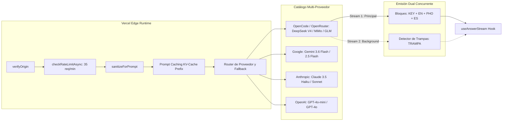

# 🏗️ Arquitectura y Mapeo del Flujo de Loro Copilot

Este documento detalla el mapa técnico integral, el ciclo de vida de los datos, los diagramas de secuencia, los modelos y los componentes que componen el funcionamiento en tiempo real de **Loro Copilot**.

---

## 🧭 1. Mapa Visual del Flujo de Datos de Extremo a Extremo


---

## 🔄 2. Desglose Fase por Fase del Flujo

### Fase 1: Ingesta y Captura Dual Simultánea (Stereo 🎧)
El sistema resuelve de raíz el problema clásico del audio en llamadas (donde capturar solo mic ignora al entrevistador y capturar solo pestaña no capta al candidato o acopla):
- **Modos de Captura Soportados:**
  - **Dual Simultáneo (🎧 Predeterminado y Recomendado):**
    - **Canal Izquierdo (L / Canal 0):** Voz del candidato adquirida mediante `navigator.mediaDevices.getUserMedia({ audio: { echoCancellation: true, noiseSuppression: true } })`.
    - **Canal Derecho (R / Canal 1):** Audio del entrevistador adquirido mediante `navigator.mediaDevices.getDisplayMedia({ video: true, audio: true })`. Los tracks de video se cancelan de inmediato (`track.stop()`) preservando 100% de CPU y GPU.
    - **Mezcla Estéreo Nativa:** Un `ChannelMergerNode(2)` de la Web Audio API combina ambos streams en un único nodo estéreo entrelazado.
  - **Modo Micrófono Solo:** Captura clásica mono del micrófono.
  - **Modo Pestaña Solo:** Captura clásica mono del audio del sistema.
- **WakeLock API:** Se adquiere un centinela de pantalla (`navigator.wakeLock.request("screen")`) para prevenir que el sistema operativo suspenda procesos en segundo plano durante llamadas extensas.

### Fase 2: Remuestreo, VAD Local y Barge-in (`public/pcm-worklet.js`)
- **Procesamiento de Audio en Hilo Aislado (`AudioWorklet`):**
  - Los navegadores capturan nativamente a 44.1kHz o 48kHz en punto flotante (`Float32Array`).
  - El procesador `pcm-worklet.js` se ejecuta en el hilo de audio del navegador sin bloquear el hilo principal de React.
  - Realiza el downsampling lineal a 16kHz y la cuantización a números enteros de 16 bits (`Int16Array PCM16`).
  - Soporta buffers estéreo entrelazados `[L0, R0, L1, R1, ...]`.
- **VAD Local y Medición RMS Dual (<80ms):**
  - Calcula la energía RMS independiente para `micRms` y `tabRms` en cada frame.
  - Detecta actividad de voz o silencio localmente en menos de 80ms, reduciendo la dependencia de latencias de red.
- **Auto-Cancelación por Barge-in (Interrupción del Entrevistador):**
  - Si el entrevistador comienza a hablar (energía detectada en Canal 1 o mensaje `barge_in` del worklet) mientras el LLM está generando una respuesta o el usuario está leyendo, el Copiloto aborta inmediatamente el `AbortController` activo, evitando que la IA quede desfasada respecto a la conversación.

### Fase 3: Transcripción Multicanal en Streaming (Deepgram Nova-2)
- **Credenciales Efímeras Seguras (`/api/deepgram-token`):**
  - La API Key permanente de Deepgram nunca se expone al cliente. Se emite un grant temporal de 60 segundos vía `POST https://api.deepgram.com/v1/auth/grant`.
- **Configuración del WebSocket:**
  ```javascript
  const params = {
    model: "nova-2",
    language: lang === "en" ? "en" : "multi",
    smart_format: "true",
    interim_results: "true",
    endpointing: "1000",
    utterance_end_ms: "1500",
    vad_events: "true",
    diarize: isDual ? "false" : "true",
    encoding: "linear16",
    sample_rate: "16000",
    channels: isDual ? "2" : "1",
    multichannel: isDual ? "true" : "false",
  };
  ```
- **Diarización 100% Determinística por Canales:**
  - `Canal 0 (L)` = Micrófono Candidato ➔ mapeado a `speaker = 1`.
  - `Canal 1 (R)` = Pestaña Entrevistador ➔ mapeado a `speaker = 0`.
  - Al aislar físicamente los canales, se elimina la ambigüedad acústica sobre quién hizo la pregunta.

### Fase 4: Inteligencia de Detección de Turno (`Turn-Taking Engine`)
Para no disparar respuestas ante silencios breves o pausas de respiración:
1. **Detección de Fin de Habla:** Disparada por VAD local o el evento `UtteranceEnd` de Deepgram.
2. **Debounce Adaptativo (1000ms):** Ventana de espera prudencial para permitir pausas naturales de pensamiento del interlocutor.
3. **Filtro de Candidato:** Si el último hablante registrado fue el candidato (`speaker === 1`), no se auto-genera respuesta para prevenir bucles de eco.
4. **Validación de Pregunta Incompleta (`isIncompleteQuestion`):**
   - Detecta si la frase quedó truncada (conectores terminales como *"and"*, *"or"*, *"pero"*, *"because"*, *"if"*, o preguntas de longitud menor a 6 caracteres). Si es incompleta, el motor posterga la generación.
5. **Aislamiento del Turno Actual (`extractCurrentTurnQuestion`):**
   - Extrae con precisión quirúrgica únicamente la última pregunta relevante sin concatenar texto previo ya respondido.

### Fase 5: RAG Semántico Local del CV (`app/lib/cvChunker.ts`)
Para evitar saturar la ventana de contexto o diluir la respuesta:
- **Segmentación (`chunkCv`):** Divide el CV del candidato en bloques semánticos estructurados (experiencia laboral por empresa, proyectos destacados, stack tecnológico, certificaciones).
- **Recuperación Quirúrgica (`selectRelevantCvChunks`):**
  - Si el perfil supera los 800 caracteres, compara los tokens y palabras clave de la pregunta con cada bloque del CV.
  - Extrae y prioriza los 1 o 2 bloques con mayor coincidencia temática para inyectarlos en el prompt del LLM, garantizando respuestas con anclaje real en la experiencia del candidato.

---

## 🧠 3. Árbol de Decisión de Respuestas: Caché Inteligente vs LLM

Antes de invocar modelos generativos externos, el sistema evalúa dos niveles de caché local de latencia ultrabaja:

```mermaid
flowchart TD
    A[Pregunta Detectada / Disparada] --> B{¿Es Saludo o Small Talk?}
    B -- Sí (<10ms) --> C[checkInstantGreeting: Retorno Inmediato]
    B -- No --> D{¿Existe en Banco de Memoria?}

    D -- Sí --> E[findMatchingAnswer: Tokenización + Sinónimos Canónicos]
    E --> F{¿Coincide Empresa y Rol?}
    F -- No --> G[Descartar / Evitar Contaminación]
    F -- Sí --> H{Score Multidimensional >= 0.65}
    H -- Sí (<50ms) --> I[Retornar MasterAnswer Local]
    H -- No --> J[RAG de CV: chunkCv + selectRelevantCvChunks]

    D -- No --> J
    J --> K[POST /api/answer: Stream 1 (Fast Answer)]
    J -.->|Paralelo en Background| L[POST /api/answer: Stream 2 (Trap Detector)]
    
    C --> M[Render UI Copiloto + Sincronización Teleprompter HUD]
    I --> M
    K --> M
    L -.->|Si detecta trampa| M
```

### Nivel 1: Saludo Inmediato (`<10ms`)
- Maneja frases de apertura como *"Hi, can you hear me?"*, *"Good morning"*, *"How are you today?"*.
- Resuelve en menos de 10ms con respuestas amables y contextualizadas con el nombre de la empresa sin consumir cuota de LLM.

### Nivel 2: Banco de Memoria Inteligente (`<50ms`)
Diseñado para preguntas frecuentes de screening, background, arquitectura y metodología STAR:
1. **Normalización y Sinónimos Canónicos (`CANONICAL_SYNONYMS`):**
   - Homologa conceptos equivalentes (ej. `pets`, `dogs`, `mascotas` ➔ `pet_concept`; `salary`, `rate`, `sueldo` ➔ `salary_concept`; `weekend`, `finde` ➔ `weekend_concept`).
2. **Aislamiento Multi-CV Determinístico:**
   - `matchesCompany(itemCompany, targetCompany)`: Impide que respuestas preparadas para una empresa se filtren en la entrevista de otra.
   - `matchesRole(itemRole, targetRole)`: Aísla el dominio técnico del puesto (ej. descarta respuestas de `[Rol: DBA]` si la entrevista actual es para `DevOps Architect`).
3. **Scoring Multidimensional:**
   - Coeficiente Jaccard (25%) + Sørensen-Dice (35%) + Cobertura Efectiva de Consulta (40%).
   - Bonus por coincidencia exacta de frase (+0.15) y tags (+0.08). Umbral mínimo: `>= 0.65`.
4. **Auto-aprendizaje (Active Learning):**
   - Cuando el usuario pulsa 👍 en una respuesta del LLM, el sistema la almacena automáticamente en el banco de memoria local (`tags: ["aprendido", "feedback_positivo"]`).

---

## ⚡ 4. Pipeline de Inferencia Edge, Prompt Caching y Dual Stream (`/api/answer`)

Cuando se requiere inferencia generativa:



### Modelos Soportados y Latencias de Referencia

| Nivel de Velocidad | Modelo | Proveedor | TTFT / Latencia Típica | Caso de Uso Principal |
|---|---|---|---|---|
| **Ultra Rápido ⚡** | `gemini-3.6-flash` | Google | ~500ms TTFT (6.0s total) | Entrevista en vivo de máxima velocidad |
| **Ultra Rápido ⚡** | `mimo-v2.5` | OpenCode | ~600ms TTFT (6.2s total) | Entrevistas en inglés fluido |
| **Ultra Rápido ⚡** | `glm-5.3-flash` | OpenCode | ~650ms TTFT (6.5s total) | Respuestas técnicas directas |
| **Ultra Rápido ⚡** | `deepseek-v4-flash` | OpenCode | ~700ms TTFT (6.6s total) | Modelo predeterminado en vivo |
| **Pro / Senior 🧠** | `deepseek-v4-pro` | OpenCode | ~800ms TTFT (6.7s total) | Arquitectura y algoritmos complejos |
| **Ultra Rápido ⚡** | `glm-5.2` | OpenCode | ~700ms TTFT (6.9s total) | Soporte multi-idioma |
| **Ultra Rápido ⚡** | `qwen-3.8-flash` | OpenCode | ~800ms TTFT (7.6s total) | Alta precisión semántica |
| **Ultra Rápido ⚡** | `mimo-v2-5-pro` | OpenCode | ~850ms TTFT (7.9s total) | Explicaciones en profundidad |
| **Balanceado 🚀** | `grok-4.6` | OpenCode | ~1.0s TTFT (9.2s total) | Respuestas balanceadas |
| **Coding 💻** | `kimi-k2-7-code` | OpenCode | ~1.2s TTFT (12.3s total) | Live coding y sintaxis estricta |
| **Deep Think 🔮** | `hy4-preview` / `qwen-3.8-max` | OpenCode | > 2.0s TTFT (>16s total) | Preguntas de diseño de sistemas pesadas |
| **Fallback Estándar** | `gpt-4o-mini` / `claude-3-5-haiku` | OpenAI / Anthropic | ~600ms TTFT | Conmutación por falla de cuota |

### Blindaje, Prompt Caching y Seguridad
- **Vercel Edge Runtime:** `export const runtime = "edge"` desplegado globalmente para minimizar latencia de red.
- **Prompt Caching en KV-Cache:** El system prompt estático y las instrucciones fijas se ubican al inicio del prompt como prefijo invariante, reduciendo el costo en un ~75% y rebajando el TTFT.
- **Sanitización Anti-Inyección (`sanitizeForPrompt`):** Convierte caracteres `<` y `>` en comillas angulares equivalentes (`‹`, `›`), anulando cualquier vector de inyección de prompt proveniente del audio transcripto o datos del usuario.
- **Rate Limit por IP:** 35 solicitudes/minuto con deslizamiento en memoria.
- **Control de Capacidad (`checkCapacity`):** Kill switch de servicio si el tráfico satura los umbrales configurados.

### Formato Punchline First y Bloques Especializados (`parseBlocks`)
1. **`[KEY]` (Punchline First):** 3 a 5 palabras clave telegráficas para que el candidato comience a hablar de inmediato sin titubear.
2. **`[EN]`:** Respuesta hablada concisa en primera persona para perfiles Senior (apertura directa de 1 frase + 2 a 3 viñetas breves de 8 a 14 palabras).
3. **`[PHO]`:** Fonética simplificada en español con acentuación tónica en mayúsculas (ej. `DE-ko-rei-ter`, `kub-er-NE-tis`, `AR-ki-tek-chur`).
4. **`[ES]`:** Resumen conceptual rápido en español para tranquilidad cognitiva.
5. **`[TRAMPA]`:** Bloque opcional emitido por el detector asíncrono de trampas que resalta sesgos, premisas falsas o trucos en la pregunta.

---

## 🪟 5. Sincronización HUD Pop-out y Lectura Biónica (`/teleprompter`)

Ventana flotante ultraliviana (540x380) diseñada para ubicarse justo debajo de la lente de la cámara web, permitiendo mantener contacto visual con el entrevistador:

- **Protocolo de Comunicación de Cero Latencia:**
  1. `BroadcastChannel("loro_teleprompter_channel")`: Transmisión en memoria entre pestañas locales en 0ms.
  2. Fallback con `localStorage("loro_teleprompter_data")` y evento `storage` ante recargas.
- **Lectura Biónica (Bionic Reading):**
  - La función `renderBionicText()` calcula el punto medio de cada palabra (`Math.ceil(word.length / 2)`) y resalta las primeras letras en `<strong className="text-white font-black">`.
  - El cerebro del candidato completa la palabra mediante visión periférica sin requerir movimientos oculares visibles.
- **Chips de Palabras Clave `[KEY]`:** Renderizados como badges destacados en la parte superior para dar dirección discursiva inmediata.
- **Banner de Alerta de Trampas:** Notificación destacada en color ámbar/rojo ante advertencias de preguntas trampa.
- **Botón Panic (`Escape`):**
  - Al pulsar `Escape`, la interfaz oculta de inmediato el texto y muestra una pantalla neutral (*"Pantalla en pausa. Presioná Escape para reanudar"*), eliminando cualquier riesgo de exposición involuntaria en pantalla compartida.
- **Auto-scroll Adaptativo y Zoom Tipográfico:** Desplazamiento automático al pie y controles `A+` / `A-`.

---

## 🎙️ 6. Telemetría de Habla en Vivo (Speech Coach - `app/lib/speechCoach.ts`)

Analizador en tiempo real de los patrones de comunicación vocal del candidato:
- **WPM (Words Per Minute):**
  - Mide la cadencia de habla en tiempo real.
  - Semáforo visual: Verde (120-150 WPM = ritmo óptimo profesional), Amarillo (<110 WPM = lento/dubitativo, >160 WPM = apresurado/nervioso).
- **Balance de Conversación (Talk-to-Listen Ratio):**
  - Porcentaje acumulado de tiempo hablando el candidato vs. escuchando al entrevistador, previniendo monopolizar la conversación.
- **Contador de Muletillas (Fillers):**
  - Detección en vivo de muletillas en inglés (*"like"*, *"you know"*, *"um"*, *"uh"*, *"actually"*, *"basically"*) y español (*"tipo"*, *"o sea"*, *"este"*, *"nada"*, *"bueno"*), alertando sutilmente para pulir la elocuencia.

---

## ⌨️ 7. Atajos de Teclado Globales

| Atajo | Ámbito | Acción |
|---|---|---|
| `Ctrl + 1` | Global | Enfocar la pestaña principal del Copiloto en vivo. |
| `Ctrl + 2` | Global | Abrir o enfocar la ventana emergente flotante del Teleprompter HUD. |
| `Ctrl + Shift + S` | Global Copiloto | **Screen Vision & Live OCR:** Capturar pantalla/pestaña para resolver LeetCode o diagramas de arquitectura. |
| `Ctrl + Shift + Q` | Global Copiloto | **Cierre de Oro:** Generar al instante 3 repreguntas estratégicas ancladas a los dolores del entrevistador. |
| `Escape` | Teleprompter HUD | Activar / Desactivar el modo Panic (ocultar pantalla de inmediato). |

---

## 🎯 8. Flujo del Modo Simulador (`/simulador`)

Entorno cerrado para práctica y entrenamiento con evaluación automática:

```
[ Usuario selecciona Rol + CV + Dificultad ]
                  │
                  ▼
   [ Loop Interactivo de Simulación ]
         ┌────────┴────────┐
         │                 │
         ▼                 ▼
   [ IA Pregunta ]   [ Candidato Responde ]
   (TTS Web Speech)  (Audio STT / Texto)
         │                 │
         └────────┬────────┘
                  │ (Al completar rondas o pulsar Finalizar)
                  ▼
   [ API /api/simulador (type: feedback) ]
                  │
                  ▼
   [ Reporte Evaluativo Estructurado JSON ]
   ├── Score Global (0 - 100) y Nivel (Junior / Semi-Senior / Senior / Staff)
   ├── Veredicto de Contratación (Strong Hire / Hire / Weak / No Hire)
   ├── Radar: Claridad, Estructura, Fit Técnico, Confianza, Comunicación
   ├── Fortalezas y Áreas de Mejora
   └── Desglose Pregunta por Pregunta con Respuesta Modelo Ideal
```

---

## 📁 9. Mapeo de Archivos y Componentes del Repositorio

| Módulo / Componente | Archivo | Responsabilidad Principal |
|---|---|---|
| **Página Principal Copiloto** | `app/app/page.tsx` | Orquestación general, switches de audio dual, vúmetro estéreo, Screen Vision (`Ctrl+Shift+S`), Susurro al Oído, Cierre de Oro (`Ctrl+Shift+Q`), render de transcripción, respuestas y atajos globales. |
| **Hook Audio / STT** | `app/hooks/useDeepgram.ts` | Captura dual (Mic + Pestaña), `ChannelMergerNode`, ciclo de vida WebSocket Deepgram, VAD local, barge-in, reconexión y pre-fetching especulativo en turnos largos. |
| **Hook Respuestas LLM** | `app/hooks/useAnswerStream.ts` | Saludo instantáneo (<10ms), matching en memoria (<50ms), RAG de CV, streaming SSE principal, pre-fetch especulativo, callback `onPunchline`, Dual Stream de trampas en background y soporte multimodal. |
| **Hook Screen Vision** | `app/hooks/useScreenVision.ts` | Captura en vivo de pantalla vía `getDisplayMedia`, renderizado en `HTMLCanvasElement`, compresión WebP base64 ultraliviana para Vision Coding. |
| **Hook Susurro al Oído** | `app/hooks/useEarbudWhisper.ts` | Sintetizador de voz Web Speech API acelerado (1.5x) para dictado privado del punchline `[KEY]` al auricular del candidato. |
| **Hook Teleprompter** | `app/hooks/useTeleprompter.ts` | Apertura de ventana emergente y sincronización bidireccional en tiempo real vía `BroadcastChannel` y `localStorage`. |
| **Hook Contexto Entrevista** | `app/hooks/useInterviewContext.ts` | Gestión de perfiles de entrevista, CVs, empresa, rol, modelo seleccionado y persistencia del banco maestro. |
| **Worklet de Audio PCM16** | `public/pcm-worklet.js` | AudioWorklet en hilo de audio: downsampling lineal a 16kHz, conversión Float32 a Int16 estéreo, RMS dual y VAD local. |
| **Segmentación RAG & Grafo Temporal** | `app/lib/cvChunker.ts` | Chunking semántico del CV, inferencia de seniority (`Architect`, `Lead`, `Senior`), extracción de impacto cuantitativo ($ / % / QPS) y recuperación ordenada por recencia temporal. |
| **Sandbox de Código & Big-O** | `app/lib/codeEvaluator.ts` | Validador estático client-side de sintaxis (JS/TS/Python), balanceo de delimitadores, sangría en Python y extracción de complejidades Big-O temporal y espacial. |
| **Speech Coach** | `app/lib/speechCoach.ts` | Telemetría en vivo: cálculo de WPM, ratio de conversación (Talk-to-Listen) y detección de muletillas. |
| **Helpers de Entrevista** | `app/lib/interviewHelpers.ts` | Sinónimos canónicos, clasificación temprana de preguntas, detector de preguntas trampa, buscador en memoria y parser de 4 bloques. |
| **Clientes y Parsers LLM** | `app/lib/llm.ts` | Clientes HTTP y parsers SSE para OpenCode, Google Gemini, OpenAI y Anthropic con soporte multimodal (`options.image`), timeouts y fallback. |
| **Seguridad y Rate Limiting** | `app/lib/security.ts` | Verificación de `Origin`/`Referer`, rate limiter en memoria (35 req/min) y comprobación de capacidad del servidor. |
| **HUD Teleprompter** | `app/teleprompter/page.tsx` | Ventana pop-out flotante stealth con Always-on-Top nativo (`documentPictureInPicture`), control de opacidad, Lectura Biónica, chips `[KEY]`, alerta de trampas y botón Panic (`Escape`). |
| **Página Simulador** | `app/simulador/page.tsx` | Interfaz de entrenamiento interactivo con voz TTS (Web Speech API) y reporte evaluativo post-entrevista. |
| **API Generación Respuestas** | `app/api/answer/route.ts` | Runtime Edge, Prompt Caching (KV-Cache), Punchline First, Spanglish técnico, Vision Coding (`mode: "vision_coding"`), Cierre de Oro (`type: "reverse_questions"`) y detector de trampas en background (`mode: "trap_detector"`). |
| **API Token Deepgram** | `app/api/deepgram-token/route.ts` | Emisión de tokens efímeros de 60 segundos para aislar la API key de Deepgram del frontend. |
| **API Simulador** | `app/api/simulador/route.ts` | Generador de preguntas dinámicas y evaluación estructurada JSON de la entrevista simulada. |
| **API Resumen Post-Entrevista** | `app/api/summary/route.ts` | Generador de minutas y resúmenes ejecutivos en Markdown de la entrevista completa. |

---

## 🚀 10. Las 8 Capacidades Estratégicas Avanzadas

### 1. Screen Vision & Live OCR Multimodal (`Ctrl+Shift+S`)
- **Problema resuelto:** En live-coding (LeetCode, HackerRank, CoderPad) o diagramas de arquitectura en Miro/Excalidraw, transcribir el enunciado o código a mano consume tiempo valioso y genera errores.
- **Implementación:** `useScreenVision` captura la pantalla o ventana del ejercicio mediante `getDisplayMedia()`, dibuja el frame en un canvas invisible de 1280px y lo codifica a WebP (calidad 0.82) en Base64. Se envía al endpoint `/api/answer` con `mode: "vision_coding"` procesado por modelos multimodales (Gemini 2.5 Flash, GPT-4o, Claude 3.5 Sonnet, OpenCode).
- **Salida:** Enfoque algorítmico estructurado, código de producción limpio con tipado estricto y análisis formal Big-O de tiempo y espacio.

### 2. Generación Especulativa Temprana (Pre-Warming)
- **Problema resuelto:** Esperar a que el entrevistador finalice una pregunta extensa (10-20 segundos) acumulando 1.5s de debounce añade latencia innecesaria.
- **Implementación:** `useDeepgram` monitoriza el canal del entrevistador (`speaker 0`). Al acumularse más de 30 caracteres en un turno activo continuo, dispara un pre-fetch especulativo en background (`startSpeculativePreFetch`). Cuando el entrevistador finaliza su turno formalmente, si la pregunta definitiva es continuación del prefijo pre-calentado, `useAnswerStream` adopta el `Response` ya en vuelo en 0ms.

### 3. Modo "Cierre de Oro" (Reverse Interviewer / `Ctrl+Shift+Q`)
- **Problema resuelto:** Al final de la entrevista ("¿Tenés alguna pregunta para nosotros?"), hacer preguntas genéricas reduce el impacto del candidato.
- **Implementación:** El motor analiza todo el transcript acumulado de la sesión, identifica tecnologías mencionadas, desafíos de escalabilidad y dolores organizacionales expresados por el entrevistador, y formula 3 repreguntas quirúrgicas de alto nivel (Arquitectura/Deuda Técnica, Cultura/Autonomía y Métricas de Éxito a 90 días).

### 4. Modo "Susurro al Oído" (Earbud Audio Whisperer)
- **Problema resuelto:** En entrevistas con webcam activa, desviar la mirada al teleprompter puede delatar la lectura de notas.
- **Implementación:** `useEarbudWhisper` se engancha al evento `onPunchline` del streaming. Apenas el LLM emite el bloque `[KEY]` (primeros 500ms), la Web Speech API sintetiza el punchline a 1.5x de velocidad en una voz sintetizada enviada exclusivamente al auricular privado del candidato.

### 5. Sandbox de Validación de Código Client-Side & Big-O
- **Problema resuelto:** Respuestas de live-coding con pequeños errores tipográficos o de sintaxis pueden arruinar una prueba técnica.
- **Implementación:** `codeEvaluator.ts` analiza estáticamente todo bloque de código en la respuesta Markdown:
  - En JavaScript/TypeScript: compila un árbol de sintaxis abstracta virtual verificando llaves, corchetes, comillas y tokens sin ejecutar código (`new Function`).
  - En Python: verifica balance de delimitadores y valida que las líneas que siguen a dos puntos (`:`) cuenten con sangría requerida.
  - Extractor Big-O: extrae la cota temporal y espacial y renderiza badges visuales en `AnswerCard` con verificación de sintaxis y conteo de líneas.

### 6. Code-Switching Dinámico Automático (Spanglish Técnico)
- **Problema resuelto:** Entrevistas bilingües donde el entrevistador alterna entre inglés y español según el tema o interlocutor.
- **Implementación:** Detección de idioma por turno con umbrales de vocabulario (`detectedLang`). Si la pregunta se formula en inglés, el copiloto entrega respuesta prioritaria en inglés formal con guía fonética `[PHO]`. Si es en español, preserva la terminología técnica nativa en inglés (ej. *throughput*, *deadlock*, *event loop*, *connection pool*).

### 7. Overlay Stealth HUD Always-on-Top (`documentPictureInPicture`)
- **Problema resuelto:** Ventanas emergentes comunes se van al fondo al hacer clic en Zoom o el navegador de la llamada.
- **Implementación:** `app/teleprompter/page.tsx` soporta la Picture-in-Picture Document API nativa (`window.documentPictureInPicture.requestWindow()`). El HUD queda anclado Always-on-Top en la esquina superior directamente debajo de la webcam, e incluye un slider de opacidad interactivo (30% - 100%) para mimetizarse con el fondo.

### 8. Grafo Temporal de Conocimiento del CV
- **Problema resuelto:** Modelos de lenguaje citan proyectos de hace 8 años como si fueran el trabajo actual del candidato.
- **Implementación:** `cvChunker.ts` extrae rangos temporales (`extractYears`), detecta si es el rol vigente (`isCurrent`), infiere nivel de seniority (`Architect`, `Lead`, `Staff`, `Senior`, `Mid`, `Junior`) y extrae métricas de impacto numérico ($ / % / QPS / ms / usuarios). `selectRelevantCvChunks` prioriza sistemáticamente los roles más recientes y con métricas comprobables.
